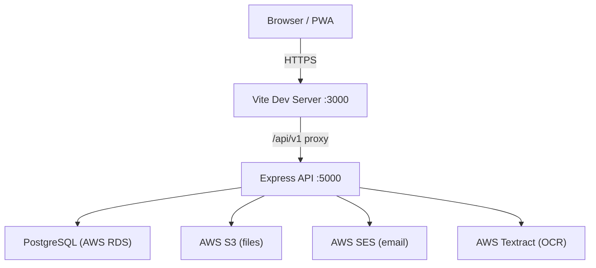

# ContractOS — Codebase Knowledge Base
> Last generated: 2026-06-23 | Based on full static analysis of the repo

---

## 1. Project Overview

**ContractOS** is an Enterprise SaaS platform for the Malaysian construction industry. It replaces the disconnected tools (Excel, WhatsApp, paper files) that construction companies use with a single unified web platform.

| Property | Value |
|---|---|
| Product | ContractOS |
| Type | Enterprise SaaS — Web + PWA |
| Industry | Construction & Contract Management |
| Market | Malaysia (MYR, Bahasa Malaysia, SST/GST, PDPA 2010) |
| Domain | contractos.my |
| Design Theme | Dark & Professional (Navy, Black, Grey, Gold) |
| Compliance | PDPA 2010, ISO 27001, SOC 2 |

### What it replaces

| Problem | Old Way | ContractOS |
|---|---|---|
| Project tracking | WhatsApp + Excel | Projects module (milestones, tasks, Gantt) |
| Invoicing / claims | Word documents | Finance & Invoicing module |
| HR & attendance | Paper / Excel | HR module with clock in/out |
| Bill of Quantities | Excel templates | BQ / Tender module with AI auto-fill (Phase 2) |
| Site safety records | Paper checklists | Safety module (DOSH/OSHA compliant) |
| Document management | USB / email | Document Manager with version control |
| Subcontractor mgmt | Calls / WhatsApp | Profiles + Subcon portal |

---

## 2. Tech Stack & Dependencies

### Frontend
| Package | Version | Purpose |
|---|---|---|
| React | ^18.2.0 | UI framework |
| React Router DOM | ^6.20.0 | Client-side routing |
| Axios | ^1.6.0 | HTTP client |
| Zustand | ^4.4.6 | Global state (auth store) |
| @tanstack/react-query | ^5.8.4 | Server state / data fetching / caching |
| react-hook-form | ^7.48.2 | Form state management |
| Recharts | ^2.10.1 | Charts and data visualisations |
| date-fns | ^2.30.0 | Date formatting utilities |
| clsx | ^2.0.0 | Conditional className helper |
| Tailwind CSS | ^3.3.5 | Utility-first styling |
| Vite | ^5.0.2 | Dev server & build tool |

### Backend
| Package | Version | Purpose |
|---|---|---|
| Express | ^5.2.1 | HTTP server & router |
| pg | ^8.21.0 | PostgreSQL client (node-postgres) |
| jsonwebtoken | ^9.0.3 | JWT auth tokens |
| bcryptjs | ^3.0.3 | Password hashing |
| helmet | ^8.2.0 | Security headers |
| cors | ^2.8.6 | CORS for frontend ↔ backend |
| morgan | ^1.10.1 | HTTP request logging |
| multer | ^2.1.1 | File uploads (diary photos, documents) |
| express-rate-limit | ^8.5.2 | API rate limiting |
| express-validator | ^7.3.2 | Input validation |
| uuid | ^14.0.0 | UUID generation |
| pdf-parse | ^2.4.5 | PDF text extraction |
| pdfkit | ^0.18.0 | PDF generation |
| xlsx | ^0.18.5 | Excel file generation |
| @aws-sdk/client-textract | ^3.1057.0 | AWS OCR (Phase 2) |
| nodemon | ^3.1.14 | Dev auto-reload |

### Infrastructure (planned / in use)
| Service | Purpose |
|---|---|
| AWS RDS (PostgreSQL) | Primary database |
| AWS S3 | File/document storage |
| AWS Cognito | Authentication (Phase 2 migration) |
| AWS SES | System emails |
| AWS Textract | OCR for BQ scanning (Phase 2) |
| AWS Bedrock | AI BQ auto-fill (Phase 2) |
| AWS EC2 + CloudFront | Hosting + CDN |
| Stripe | Subscription billing (FPX + card) |
| GitHub Actions | CI/CD |

---

## 3. Folder Structure

```
contractos/
├── backend/                   # Node.js / Express API server
│   ├── src/
│   │   ├── server.js          # Entry point — mounts middleware, routes, daily sweep
│   │   ├── config/
│   │   │   ├── constants.js   # Roles, subscription tiers, limits, status enums
│   │   │   ├── database.js    # pg Pool, query(), withTransaction(), getClient()
│   │   │   ├── seed.js        # Demo tenant + users seeder
│   │   │   ├── seed_projects.js  # Full demo data seeder
│   │   │   └── migrations/    # Numbered SQL migration files (001–012)
│   │   ├── controllers/
│   │   │   └── auth.controller.js  # signup, login, verifyEmail, forgotPassword, resetPassword
│   │   ├── middleware/
│   │   │   ├── auth.js        # JWT authenticate + role-based authorize
│   │   │   ├── errorHandler.js # Global Express error handler
│   │   │   └── rateLimiter.js  # API rate limiter config
│   │   ├── routes/
│   │   │   ├── index.js       # Mounts all sub-routers under /api/v1
│   │   │   ├── auth.routes.js
│   │   │   ├── projects.routes.js
│   │   │   ├── tracking.routes.js  # Site diary / site tracking (mounted on /projects)
│   │   │   ├── finance.routes.js
│   │   │   ├── invoices.routes.js
│   │   │   ├── hr.routes.js
│   │   │   ├── bq.routes.js
│   │   │   ├── crm.routes.js
│   │   │   ├── safety.routes.js
│   │   │   ├── fleet.routes.js
│   │   │   ├── inventory.routes.js
│   │   │   ├── documents.routes.js
│   │   │   ├── profiles.routes.js
│   │   │   ├── users.routes.js
│   │   │   ├── notifications.routes.js
│   │   │   ├── rates.routes.js
│   │   │   └── automation.routes.js
│   │   └── services/
│   │       ├── automationService.js   # Daily sweep, aging, escalations, all notifications
│   │       ├── bqService.js           # BQ helpers: transitions, total recompute, audit
│   │       ├── bqExport.js            # BQ → Excel/PDF export
│   │       ├── bqExtractor.js         # PDF BQ extraction (Phase 2)
│   │       ├── bqIntelligence.js      # AI BQ auto-fill (Phase 2)
│   │       ├── ocrTextract.js         # AWS Textract OCR
│   │       ├── pdfService.js          # PDF generation helpers
│   │       └── siteTrackingService.js # Site diary helpers
│   ├── .env                   # Local env vars (gitignored in prod)
│   ├── .env.example           # Template for env vars
│   └── package.json
│
├── frontend/                  # React + Vite SPA
│   ├── src/
│   │   ├── main.jsx           # React entry — renders <App> in <BrowserRouter>
│   │   ├── App.jsx            # Route definitions + PrivateRoute / PublicRoute guards
│   │   ├── index.css          # Global CSS variables (design tokens), base styles
│   │   ├── store/
│   │   │   └── authStore.js   # Zustand store — user, token, isAuthenticated (persisted)
│   │   ├── lib/
│   │   │   └── api.js         # Axios instance — auto-attaches token, handles 401 redirect
│   │   ├── layouts/
│   │   │   └── DashboardLayout.jsx  # Sidebar + topbar + <Outlet> + CommandPalette
│   │   ├── components/
│   │   │   ├── BrandLogo.jsx        # ContractOS logo SVG component
│   │   │   ├── Charts.jsx           # Shared Recharts chart components
│   │   │   ├── Icon.jsx             # Central icon registry (name → SVG)
│   │   │   └── NotificationBell.jsx # Bell icon with unread count badge
│   │   └── pages/
│   │       ├── LandingPage.jsx
│   │       ├── auth/
│   │       │   ├── LoginPage.jsx
│   │       │   ├── SignupPage.jsx
│   │       │   ├── VerifyEmailPage.jsx
│   │       │   └── SetupWizardPage.jsx  # Post-signup onboarding wizard
│   │       ├── dashboard/DashboardPage.jsx
│   │       ├── projects/
│   │       │   ├── ProjectsPage.jsx
│   │       │   └── ProjectDetailPage.jsx
│   │       ├── finance/
│   │       │   ├── FinancePage.jsx   # 5-tab Finance: Cockpit, AR, Certs, Retention, MyInvois
│   │       │   ├── tabCockpit.jsx
│   │       │   ├── tabReceivables.jsx
│   │       │   ├── tabCerts.jsx
│   │       │   ├── tabRetention.jsx
│   │       │   ├── tabMyInvois.jsx   # LHDN e-invoicing tab
│   │       │   ├── finCharts.jsx
│   │       │   ├── finData.js
│   │       │   ├── NewPCModal.jsx    # New Payment Certificate modal
│   │       │   └── finance.css
│   │       ├── invoicing/InvoicingPage.jsx
│   │       ├── hr/HRPage.jsx
│   │       ├── bq/BQPage.jsx
│   │       ├── crm/CRMPage.jsx
│   │       ├── safety/SafetyPage.jsx
│   │       ├── fleet/FleetPage.jsx
│   │       ├── inventory/InventoryPage.jsx
│   │       ├── documents/DocumentsPage.jsx
│   │       ├── profiles/ProfilesPage.jsx
│   │       ├── pipeline/PipelinePage.jsx  # Lead→BQ→Claim→Paid pipeline view
│   │       ├── users/UserManagementPage.jsx
│   │       ├── settings/SettingsPage.jsx
│   │       └── rates/MarketRatesPage.jsx
│   ├── index.html
│   ├── vite.config.js         # Vite config — proxies /api to backend
│   ├── tailwind.config.js
│   └── package.json
│
├── docker-compose.yml         # Local dev stack (backend + postgres)
├── start-dev.bat              # Windows shortcut to start both servers
├── ContractOS_Developer_Brief.md  # Product brief / spec doc
├── KNOWLEDGE_BASE.md          # Prior knowledge base (older)
└── docs/
    ├── ContractOS_System_Requirements v2.xlsx
    └── Finance_Module_Gap_Audit.xlsx
```

---

## 4. Core Architecture & Patterns

### Overall Architecture



### Multi-Tenancy Model

Every database table has a `tenant_id UUID` column. All queries are scoped to `req.tenant_id` (set by the auth middleware). One company = one tenant row. Users belong to a tenant. Data is never shared across tenants.

```
tenants (1) ──< users (N)
tenants (1) ──< projects, claims, invoices, bq_documents, ... (N)
```

### Authentication Flow

```mermaid
sequenceDiagram
    Client->>+API: POST /auth/login {email, password}
    API->>DB: SELECT user + tenant by email
    API->>API: bcrypt.compare(password, hash)
    API-->>-Client: { token: JWT, user: {...} }
    Client->>Client: Zustand persist → localStorage
    Client->>+API: Any request with Authorization: Bearer <JWT>
    API->>API: jwt.verify → decoded.userId
    API->>DB: SELECT user JOIN tenant WHERE id=userId AND is_active=true
    API->>API: req.user = row; req.tenant_id = row.tenant_id
    API-->>-Client: Response
```

- JWT is stateless — logout just clears localStorage
- 24-hour token expiry (configurable via `JWT_EXPIRES_IN`)
- Failed logins increment `failed_login_attempts` counter
- Email verification required in production (skipped in `NODE_ENV=development`)

### Route Protection (Frontend)

```jsx
// PrivateRoute: redirect to /login if not authenticated
// PublicRoute: redirect to /dashboard if already authenticated
```

All `/dashboard/*` routes are wrapped in `<PrivateRoute>` inside `DashboardLayout`.

### Role-Based Access Control (Backend)

```js
// Middleware chain pattern used in all routes:
router.get('/endpoint', authenticate, authorize('director', 'admin', 'pm'), handler);
```

`authenticate` populates `req.user` with role. `authorize(...roles)` checks `req.user.role` against allowed list.

### Database Access Pattern

All routes receive `req.db` (injected by server middleware) but most routes use the module-level `query()` import directly. Transactions use `withTransaction(async (q) => { ... })`.

```js
// Simple query
const { rows } = await query('SELECT * FROM projects WHERE tenant_id=$1', [tenantId]);

// Transaction
await withTransaction(async (q) => {
  await q('INSERT INTO tenants ...', [...]);
  await q('INSERT INTO users ...', [...]);
});
```

### Frontend Data Fetching

React Query is used for all server state. Pattern:

```jsx
const { data, isLoading } = useQuery({
  queryKey: ['unique-key'],
  queryFn: () => api.get('/endpoint').then(r => r.data),
  staleTime: 5 * 60_000,  // 5 minutes
});
```

Mutations use `api.post/put/delete` directly, then call `queryClient.invalidateQueries`.

### Automation / Background Jobs

`automationService.js` is the "glue layer" — it handles all cross-module notifications and scheduled work:

- **Daily sweep** runs 5s after server boot and every 24h
- Jobs: `runAging()` → `runWeeklyEscalation()` → `runWeeklyInvoiceEscalation()` → `runMilestoneOverdueCheck()`
- All jobs are idempotent (SQL date guards prevent double-firing)
- Disable entirely: `AGING_JOB=off`
- Results logged to `automation_logs` table

---

## 5. Key Modules / Components

### 5.1 Auth Module
**Backend:** `auth.controller.js` + `auth.routes.js`
**Frontend:** `LoginPage`, `SignupPage`, `VerifyEmailPage`, `SetupWizardPage`

- Signup creates **both** a `tenants` row and a `users` row in one transaction
- First user of any company always gets the `director` role
- Password hashed with bcrypt (cost factor 12)
- Email verification token is a UUID stored in `users.email_verification_token`
- Password reset uses time-limited token (`password_reset_expires`)

### 5.2 Projects Module
**Backend:** `projects.routes.js` + `tracking.routes.js`
**Frontend:** `ProjectsPage.jsx` + `ProjectDetailPage.jsx`

Full project lifecycle with:
- **Members** — team assignment with `role_in_project`
- **Milestones** — critical path tracking with `overdue_alerted_at` guard
- **Tasks** — linked to milestones, assigned to users
- **RFIs** — Request for Information workflow (draft → submitted → responded → closed)
- **Change Orders** — VO tracking with auto-approval below `change_order_threshold`
- **Submittals** — material/shop drawing approval workflow
- **Risks** — risk register with likelihood × impact and trend
- **Site Diaries** — daily progress records with weather, manpower, photo attachments
- **Project Scope** — BQ items imported into a live scope tracking table

Project statuses: `active | on_hold | completed | cancelled | pending_customer | pending_vendor | pending_payment`

### 5.3 Finance Module
**Backend:** `finance.routes.js`
**Frontend:** `FinancePage.jsx` (5 tabs) + sub-tab components

Five tabs:
1. **Cockpit** — KPI overview (outstanding AR, certified pending, overdue certs)
2. **Receivables** — Aging matrix (0–30, 31–60, 61–90, 90+ days) + dunning send-all
3. **Payment Certs** — Live cert list, new PC modal, cert status pipeline
4. **Retention & Bonds** — Retention balances per project, performance bonds, statutory deductions
5. **MyInvois** — LHDN e-invoicing integration tab

Claims pipeline: `draft → submitted → under_review → certified → paid | rejected`
Payment cert statuses: `pending | certified | paid | overdue`

### 5.4 Invoicing Module
**Backend:** `invoices.routes.js`
**Frontend:** `InvoicingPage.jsx`

- Linked to `claims` and `profiles (client)`
- Invoice statuses: `draft | unpaid | paid | overdue | partially_paid | cancelled`
- Multi-currency support (default MYR)
- SST/GST toggle via `tax_rate` field
- `last_reminder_sent` tracked for weekly escalation

### 5.5 BQ / Tender Module
**Backend:** `bq.routes.js` + `bqService.js` + `bqExport.js`
**Frontend:** `BQPage.jsx`

- Status workflow: `draft → submitted → approved | archived`
- `EDITABLE_STATUSES = ['draft', 'submitted']`
- Line items in `bq_items` (code, description, unit, qty, rate, amount, section)
- `recomputeTotal()` recalculates `bq_documents.total_amount` after any item change
- `bq_audit` table tracks all status transitions
- **Scope import:** On BQ approval, items auto-import into `project_scope` table via `importBqScope()`
- Export to Excel/PDF via `bqExport.js`
- Phase 2: OCR scanning (`bqExtractor.js`) + AI auto-fill (`bqIntelligence.js`)

### 5.6 HR Module
**Backend:** `hr.routes.js`
**Frontend:** `HRPage.jsx`

Tables: `attendance` (clock in/out), `leave_requests`, `payroll_records`

Leave types: `annual | sick | emergency | unpaid | maternity | paternity | other`
Payroll includes: `basic_salary`, `overtime_hours/rate/pay`, `allowances`, `deductions`, `epf_employee`, `socso`, `pcb`, `net_pay`

### 5.7 CRM Module
**Backend:** `crm.routes.js`
**Frontend:** `CRMPage.jsx` + `PipelinePage.jsx`

- Lead stages: `new → contacted → qualified → tender_submitted → won | lost`
- `converted_project_id` FK for converting a won lead into a project
- `PipelinePage` shows a kanban-style Lead → BQ → Claim → Paid pipeline view

### 5.8 Safety Module
**Backend:** `safety.routes.js`
**Frontend:** `SafetyPage.jsx`

Tables:
- `safety_incidents` — incident type, severity, investigation notes, corrective actions
- `safety_certifications` — worker certs with expiry tracking
- `toolbox_talks` — safety talks with attendee count

Incident types: `accident | near_miss | dangerous_occurrence | occupational_disease`
Severity: `minor | moderate | serious | fatal`

### 5.9 Fleet Module
**Backend:** `fleet.routes.js`
**Frontend:** `FleetPage.jsx`

Tables: `fleet_vehicles`, `fleet_maintenance`
Vehicle types: `car | truck | lorry | machinery | equipment | other`
Tracks: insurance expiry, road tax expiry, assigned project, maintenance schedule

### 5.10 Inventory Module
**Backend:** `inventory.routes.js`
**Frontend:** `InventoryPage.jsx`

Item types: `consumable | returnable`
Transaction types: `in | out | borrow | return | adjustment`
Low-stock alerts via `low_stock_threshold`

### 5.11 Document Manager
**Backend:** `documents.routes.js`
**Frontend:** `DocumentsPage.jsx`

- Self-referential `parent_id` for folder hierarchy
- Versioning via `version` integer column
- Signed status + `signed_at` timestamp
- Files served from `/uploads/` (static) or AWS S3 in production

### 5.12 Profiles Module
**Backend:** `profiles.routes.js`
**Frontend:** `ProfilesPage.jsx`

Profile types: `subcon | client | supplier | main_contractor | organisation`
Stores: company name, SSM registration, contact, bank details

### 5.13 User Management
**Backend:** `users.routes.js`
**Frontend:** `UserManagementPage.jsx`

- Invite new users (assigned to same tenant)
- Role assignment from 13 available roles
- Deactivate users (`is_active = false`)
- User limits enforced per subscription tier

### 5.14 Notifications System
**Backend:** `notifications.routes.js` + `automationService.js`
**Frontend:** `NotificationBell.jsx`

All notification creation goes through `automationService.notifyUsers()` / `notifyRoles()` / `notifyProjectStakeholders()`. Types: `info | success | warning | danger`. `is_fixed` = pinned notification.

### 5.15 Automation Service
**File:** `backend/src/services/automationService.js`

The central "glue" service. Responsibilities:
- `notifyUsers(ids, payload)` — insert notifications to specific users
- `notifyRoles(roles, payload)` — notify all users with given roles in a tenant
- `notifyProjectStakeholders(projectId, roles, payload)` — roles + PM
- `runAging()` — flip overdue payment certs and invoices
- `runWeeklyEscalation()` — re-notify on certs overdue for 7+ days
- `runWeeklyInvoiceEscalation()` — same for invoices
- `runMilestoneOverdueCheck()` — flag overdue milestones
- `runDailySweep()` — runs all four in parallel
- `importBqScope()` — bulk-import BQ items to project scope
- Event notifications: `notifyClaimStatus`, `notifyBqStatus`, `notifyChangeOrderPending`, `notifyInvoiceEvent`, `notifyIncidentReported`, `notifyLeadWon`
- `logRun()` / `getAutomationStatus()` — persistence to `automation_logs`

---

## 6. Data Models & Flows

### Core Database Tables

| Table | Key Columns | Notes |
|---|---|---|
| `tenants` | id, company_name, subscription_tier, stripe_customer_id, change_order_threshold | One per company |
| `users` | id, tenant_id, name, email, password_hash, role, is_active, email_verified | 13 roles |
| `audit_logs` | tenant_id, user_id, action, module, old_values JSONB, new_values JSONB | ISO 27001 |
| `notifications` | tenant_id, user_id, title, message, type, is_read, is_fixed, link | In-app only (email Phase 2) |
| `automation_logs` | event, affected_count, duration_ms, detail JSONB | Background job audit |
| `profiles` | tenant_id, profile_type, company_name, bank_name, bank_account_number | Subcon / client / supplier |
| `projects` | tenant_id, project_number, name, status, client_id→profiles, pm_id→users, contract_sum, retention_percentage | Core project entity |
| `project_members` | project_id, user_id, role_in_project | Unique per project+user |
| `project_milestones` | project_id, title, due_date, is_completed, is_critical, overdue_alerted_at | |
| `project_tasks` | project_id, milestone_id, title, status, assigned_to, priority, progress_pct | |
| `project_rfis` | project_id, rfi_number, subject, urgency, status, response | |
| `project_change_orders` | project_id, co_number, title, cost_change, time_change, status | Auto-approve below threshold |
| `project_submittals` | project_id, submittal_number, title, submittal_type, revision_number, status | |
| `project_risks` | project_id, title, category, likelihood, impact, trend, status | |
| `project_scope` | project_id, bq_id, bq_item_id, item_code, description, unit, contract_qty | BQ → scope import |
| `site_diaries` | tenant_id, project_id, diary_date, weather, manpower, notes | |
| `site_diary_entries` | diary_id, content | |
| `site_diary_photos` | diary_id, photo_url | |
| `claims` | tenant_id, project_id, claim_number, claim_type, amount, retention_amount, net_amount, status | |
| `payment_certificates` | tenant_id, project_id, claim_id, cert_number, certified_amount, status, due_date, last_reminder_sent | |
| `invoices` | tenant_id, project_id, client_id, invoice_number, subtotal, tax_rate, total, status, last_reminder_sent | |
| `invoice_items` | invoice_id, description, quantity, unit_price, amount | |
| `bq_documents` | tenant_id, project_id, title, version, status, total_amount, deleted_at | |
| `bq_items` | bq_id, item_code, description, unit, quantity, unit_rate, amount, section | |
| `bq_audit` | bq_id, tenant_id, user_id, action, from_status, to_status | |
| `market_rates` | tenant_id, category, item_name, unit, rate, our_rate, source | Manual at MVP |
| `documents` | tenant_id, project_id, name, file_url, version, category, signed, parent_id | Folder tree via parent_id |
| `attendance` | tenant_id, user_id, clock_in, clock_out, project_id | Clock in/out |
| `leave_requests` | tenant_id, user_id, leave_type, start_date, end_date, status | |
| `payroll_records` | tenant_id, user_id, period_month, period_year, basic_salary, net_pay, status | Unique per user/period |
| `inventory_items` | tenant_id, name, item_type, unit, quantity, low_stock_threshold | |
| `inventory_transactions` | item_id, transaction_type, quantity, project_id | |
| `safety_incidents` | tenant_id, project_id, incident_type, severity, status | |
| `safety_certifications` | tenant_id, user_id, cert_name, expiry_date, status | |
| `toolbox_talks` | tenant_id, project_id, topic, talk_date, attendees_count | |
| `crm_leads` | tenant_id, title, client_name, stage, status, estimated_value, converted_project_id | |
| `fleet_vehicles` | tenant_id, vehicle_type, registration_number, status, assigned_project_id | |
| `fleet_maintenance` | vehicle_id, maintenance_type, scheduled_date, cost, status | |

### Key Data Flows

#### Signup Flow
```
POST /auth/signup
→ withTransaction:
    INSERT INTO tenants (id, company_name, subscription_tier='free')
    INSERT INTO users (id, tenant_id, role='director', email_verification_token=UUID)
→ TODO: send email via AWS SES
→ 201 Created
```

#### Login Flow
```
POST /auth/login
→ SELECT user JOIN tenant WHERE email=$1
→ bcrypt.compare(password, hash)
→ UPDATE users SET failed_login_attempts=0, last_login_at=NOW()
→ jwt.sign({ userId }, JWT_SECRET, { expiresIn })
→ 200 { token, user: { id, name, email, role, tenantId, companyName, subscriptionTier } }
```

#### Finance Aging (Daily)
```
automationService.runAging()
→ UPDATE payment_certificates SET status='overdue' WHERE status IN ('pending','certified') AND due_date < CURRENT_DATE
→ UPDATE invoices SET status='overdue' WHERE status IN ('unpaid','partially_paid') AND due_date < CURRENT_DATE
→ notifyRoles(['director','admin','finance'], warning notification)
→ logRun('aging', { certsOverdue, invoicesOverdue })
```

#### BQ Approval → Scope Import
```
PATCH /bq/:id/status { status: 'approved' }
→ canTransition(current, 'approved') check
→ UPDATE bq_documents SET status='approved'
→ importBqScope(bqId, projectId, tenantId)
    → INSERT INTO project_scope SELECT from bq_items WHERE bq_id=$1
      ON CONFLICT DO NOTHING
→ audit log
→ notifyBqStatus(bq, tenantId) → notify qs + finance
```

---

## 7. Important Files

### `backend/src/server.js`
Entry point. Configures Express: security headers (helmet), CORS, JSON parsing, static `/uploads` endpoint, `req.db` injection, global rate limiter, route mounting at `/api/v1`, 404 and error handlers. Starts the daily automation sweep 5 seconds after boot, then every 24h. The `AGING_JOB=off` env var disables the sweep.

### `backend/src/config/database.js`
Exports `query(text, params)`, `withTransaction(fn)`, `getClient()`, and the raw `pool`. Uses `pg.Pool` with max 20 connections, 30s idle timeout. Query duration logged in development. `withTransaction` acquires a dedicated client, runs BEGIN/COMMIT, and always releases.

### `backend/src/middleware/auth.js`
Exports `authenticate` (JWT verification + user lookup that also fetches `subscription_tier`) and `authorize(...roles)` (role whitelist check). `req.tenant_id` is set as a convenience alias alongside `req.user`.

### `backend/src/config/constants.js`
Single source of truth for: `ROLES` (13 roles), `SUBSCRIPTION_TIERS`, `USER_LIMITS` (Free=3, Pro=15, Business=50, Enterprise=∞), `PROJECT_STATUSES`, `PAYMENT_STATUSES`, `CHANGE_ORDER_THRESHOLD_DEFAULT=10000`, `SESSION_TIMEOUT_DEFAULT=30`.

### `backend/src/controllers/auth.controller.js`
Full auth lifecycle: signup (tenant+user transaction), login (bcrypt verify, failed attempt tracking), email verification, forgot/reset password. JWT tokens are generated with `generateToken(userId)`. Email sending is stubbed out with `// TODO: AWS SES`.

### `backend/src/services/automationService.js`
The largest service file. Centralises all notification creation and scheduled background jobs. Every module that changes status (claims, invoices, BQ, safety incidents, etc.) calls the relevant `notify*` function here to fan-out in-app notifications to the correct roles/users.

### `backend/src/services/bqService.js`
Shared helpers for BQ route handlers: `canTransition(from, to)`, `recomputeTotal(bqId, client)`, `audit(payload, client)`, `getBq(id, tenantId, client)`. Defines `TRANSITIONS` (state machine) and `EDITABLE_STATUSES`.

### `frontend/src/store/authStore.js`
Zustand store persisted to localStorage under key `contractos-auth`. Stores `{ user, token, isAuthenticated }`. Exposes `setAuth(user, token)`, `clearAuth()`, `updateUser(updates)`.

### `frontend/src/lib/api.js`
Axios instance with `baseURL: '/api/v1'`. Request interceptor reads `token` from Zustand's persisted localStorage and sets `Authorization: Bearer <token>`. Response interceptor handles 401 by clearing auth and redirecting to `/login`.

### `frontend/src/App.jsx`
Root router. Defines all routes including `PrivateRoute` (auth guard) and `PublicRoute` (redirect if already logged in). All authenticated routes are nested inside `DashboardLayout` as a parent route, making the layout persistent across navigation.

### `frontend/src/layouts/DashboardLayout.jsx`
The main app shell. Collapsible sidebar (full ↔ icon mode), topbar with CommandPalette trigger (`⌘K`), notification bell, user pill, org card. Sidebar nav is a static `NAV` array with 4 sections (Workspace, Commercial, People & Market, Admin). Live badge counts fetched via React Query.

### `backend/src/config/migrations/001_initial_schema.sql`
Foundation: `tenants`, `users`, `audit_logs`, `notifications` tables + `update_updated_at()` trigger function reused by all subsequent migrations.

### `backend/src/config/migrations/002_projects_finance_hr.sql`
Adds: `profiles`, `projects`, `project_members`, `project_milestones`, `project_tasks`, `claims`, `payment_certificates`, `invoices`, `invoice_items`, `attendance`, `leave_requests`, `payroll_records`, `inventory_items`, `inventory_transactions`.

### `backend/src/config/migrations/003_bq_safety_crm_fleet.sql`
Adds: `bq_documents`, `bq_items`, `market_rates`, `documents`, `safety_incidents`, `safety_certifications`, `crm_leads`, `fleet_vehicles`, `fleet_maintenance`, `rfis`, `change_orders`.

---

## 8. Setup & Development Guide

### Prerequisites
- Node.js 18+
- PostgreSQL 14+ (local or AWS RDS)
- Git

### Backend Setup
```bash
cd backend
cp .env.example .env
# Edit .env — fill DB_HOST, DB_NAME, DB_USER, DB_PASSWORD, JWT_SECRET

npm install

# Run all SQL migrations in order (001 → 012):
psql -U postgres -d contractos -f src/config/migrations/001_initial_schema.sql
psql -U postgres -d contractos -f src/config/migrations/002_projects_finance_hr.sql
# ... up to 012

# Seed demo data (creates "Demo Construction Sdn Bhd" tenant + users):
npm run seed

# Seed full project data (4 projects, BQ, claims, invoices, etc.):
npm run seed:projects
# OR via API (dev only):
# POST http://localhost:5000/api/v1/dev/seed-projects

# Start dev server (nodemon, auto-reload):
npm run dev

# Start production server:
npm start
```

### Frontend Setup
```bash
cd frontend
npm install

# Start dev server (proxies /api → http://localhost:5000):
npm run dev

# Build for production:
npm run build
```

### Environment Variables (`.env`)
| Variable | Required | Description |
|---|---|---|
| `PORT` | No | API port (default 5000) |
| `NODE_ENV` | Yes | `development` / `production` |
| `FRONTEND_URL` | Yes | For CORS — e.g. `http://localhost:3000` |
| `DB_HOST` | Yes | PostgreSQL host |
| `DB_PORT` | No | PostgreSQL port (default 5432) |
| `DB_NAME` | Yes | Database name |
| `DB_USER` | Yes | Database user |
| `DB_PASSWORD` | Yes | Database password |
| `JWT_SECRET` | Yes | Long random string for JWT signing |
| `JWT_EXPIRES_IN` | No | Token expiry (default `24h`) |
| `AWS_REGION` | Phase 2 | `ap-southeast-3` (KL) |
| `AWS_ACCESS_KEY_ID` | Phase 2 | AWS credentials |
| `AWS_SECRET_ACCESS_KEY` | Phase 2 | AWS credentials |
| `AWS_S3_BUCKET` | Phase 2 | File storage bucket |
| `AWS_SES_FROM_EMAIL` | Phase 2 | Email sender |
| `STRIPE_SECRET_KEY` | Phase 2 | Stripe billing |
| `STRIPE_WEBHOOK_SECRET` | Phase 2 | Stripe webhooks |
| `AGING_JOB` | No | Set to `off` to disable daily sweep |

### Demo Login Credentials (after seeding)
The seed creates a tenant "Demo Construction Sdn Bhd" with users for each role. Check `backend/src/config/seed.js` for the exact emails and password.

---

## 9. Common Tasks & How To

### Add a new API route / module

1. Create `backend/src/routes/mymodule.routes.js`
2. Create a migration SQL file (next number, e.g. `013_mymodule.sql`) and run it
3. In `routes/index.js`, `require` your new routes file and add: `router.use('/mymodule', mymoduleRoutes)`
4. All routes should start with `authenticate` middleware and scope queries to `req.tenant_id`

```js
// Pattern for a GET list endpoint:
router.get('/', authenticate, async (req, res, next) => {
  try {
    const { rows } = await query(
      'SELECT * FROM my_table WHERE tenant_id = $1 ORDER BY created_at DESC',
      [req.tenant_id]
    );
    res.json(rows);
  } catch (err) {
    next(err);
  }
});
```

### Add a new frontend page

1. Create `frontend/src/pages/mymodule/MyModulePage.jsx`
2. Import it in `App.jsx` and add `<Route path="mymodule" element={<MyModulePage />} />`
3. Add a nav item to the `NAV` array in `DashboardLayout.jsx`
4. Add an entry to `CMD_ITEMS` in `DashboardLayout.jsx` for command palette

### Send an in-app notification

```js
const { notifyRoles, notifyProjectStakeholders } = require('../services/automationService');

// Notify all directors and admins in a tenant:
await notifyRoles(['director', 'admin'], {
  tenantId: req.tenant_id,
  title: 'Something happened',
  message: 'Details here.',
  type: 'info', // 'info' | 'success' | 'warning' | 'danger'
  link: '/dashboard/some-page',
});

// Notify a project's PM + specific roles:
await notifyProjectStakeholders(projectId, ['director', 'finance'], {
  tenantId: req.tenant_id,
  title: 'Payment overdue',
  message: '...',
  type: 'warning',
  link: '/finance',
});
```

### Run a database transaction

```js
const { withTransaction } = require('../config/database');

await withTransaction(async (q) => {
  const { rows } = await q('INSERT INTO claims (...) VALUES (...) RETURNING id', [...]);
  const claimId = rows[0].id;
  await q('INSERT INTO payment_certificates (...) VALUES (...)', [...claimId...]);
});
// Automatically commits on success, rolls back on error
```

### Change BQ status (with workflow guard)

```js
const { canTransition, recomputeTotal, audit, getBq } = require('../services/bqService');

const bq = await getBq(id, tenantId);
if (!canTransition(bq.status, newStatus)) {
  return res.status(400).json({ error: `Cannot transition from ${bq.status} to ${newStatus}` });
}
// Perform the UPDATE, then:
await audit({ bqId: id, tenantId, userId: req.user.id, action: 'status_change', fromStatus: bq.status, toStatus: newStatus });
await notifyBqStatus(updatedBq, tenantId);
```

### Add a new DB column safely

1. Create a new migration file (next sequence number)
2. Use `ALTER TABLE ... ADD COLUMN IF NOT EXISTS ...`
3. If backfilling from existing data, add the `UPDATE` statement
4. Run the migration on dev, test, then production

### Trigger / test the daily sweep manually

```bash
# Via API (dev only — automation.routes.js):
POST /api/v1/automation/sweep

# Check last run times:
GET /api/v1/automation/status
```

---

## 10. Glossary of Key Concepts

| Term | Definition |
|---|---|
| **Tenant** | One company using ContractOS. All data is scoped to a tenant. |
| **Director** | The highest-privilege role — full access to everything. First signup user always gets this role. |
| **BQ / Bill of Quantities** | The itemised cost breakdown of a construction project. Central to Malaysian construction contracts. |
| **Claim / Progress Claim** | Periodic invoice a contractor submits to the client for work done to date. |
| **Payment Certificate (PC)** | Client-issued document certifying how much of a claim will be paid. |
| **Retention** | A percentage (typically 10%) withheld from each payment cert as security against defects. Released at Practical Completion (CPC). |
| **CPC** | Certificate of Practical Completion — issued when project is substantially complete. Triggers release of first half of retention. |
| **LOA** | Letter of Award — formal award of a contract. |
| **RFI** | Request for Information — formal written query from contractor to consultant/client. |
| **Change Order / VO** | Variation Order — approved change to project scope, affecting cost or time. |
| **Submittal** | Contractor submission of materials, shop drawings, or method statements for consultant approval. |
| **DOSH** | Department of Occupational Safety and Health — Malaysian government safety regulator. |
| **OSHA** | Occupational Safety and Health Act 1994 — Malaysian safety legislation. |
| **SHASSIC** | Safety and Health Assessment System in Construction — Malaysian safety audit standard. |
| **CIDB** | Construction Industry Development Board — Malaysian construction industry regulator. |
| **KPKT** | Ministry of Housing and Local Government — sets construction cost benchmarks. |
| **SST** | Sales and Services Tax — Malaysian tax (replaced GST in 2018). |
| **MyInvois** | LHDN (Malaysian IRB) e-invoicing mandate — digital invoice submission to the tax authority. |
| **PDPA 2010** | Personal Data Protection Act 2010 — Malaysian data privacy law. |
| **Aging Matrix** | AR report showing outstanding invoices bucketed by days overdue (0–30, 31–60, 61–90, 90+). |
| **Dunning** | The process of sending payment reminders for overdue invoices/certs. Automated weekly by `automationService`. |
| **EPF** | Employees Provident Fund — Malaysian mandatory retirement contribution. |
| **SOCSO** | Social Security Organisation — Malaysian workplace injury insurance. |
| **PCB** | Potongan Cukai Bulanan — monthly tax deduction (income tax withheld at source). |
| **Project Scope** | The `project_scope` table is a live copy of BQ items for tracking actual progress vs. contracted quantities. |
| **Pipeline** | The CRM-to-finance funnel: Lead → BQ → Claim → Paid, visualised in `PipelinePage`. |
| **Automation Sweep** | The daily background job that ages overdue items, sends escalation notifications, and checks milestone deadlines. |
| **Multi-tenancy** | Every DB query is scoped by `tenant_id`. No data leaks between companies. |
| **req.tenant_id** | Express request property set by `authenticate` middleware — shortcut for `req.user.tenant_id`. |
| **withTransaction** | Database helper that wraps multiple queries in a single atomic transaction (BEGIN/COMMIT/ROLLBACK). |
| **EDITABLE_STATUSES** | BQ documents can only have line items edited when in `draft` or `submitted` status. |
| **change_order_threshold** | Per-tenant (and per-project) value below which a CO is auto-approved without director sign-off. Default RM 10,000. |
| **last_reminder_sent** | Timestamp on invoices/certs — prevents the weekly escalation from sending duplicate reminders within 7 days. |
